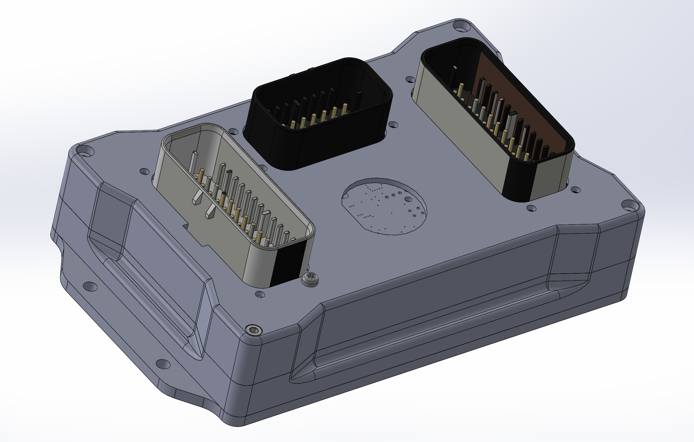

# PROTEUS case 

#### Hardware needed
4 x [M3 x 0.5 mm, 30 mm long](https://www.mcmaster.com/91292A022/)\
12 x [M3, 8 mm long, thread forming screws for plastic](https://www.mcmaster.com/96817A908/)

Cut mounting plate from .187" aluminum (4.7mm) and tap M3x0.5 (4x)